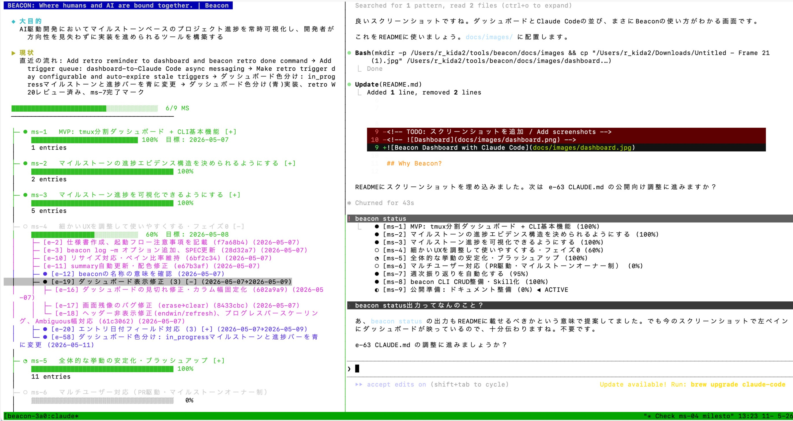

# Beacon

**Milestone-driven project dashboard for AI-assisted development**

AIアシスタント（Claude Code等）との開発セッションにおいて、マイルストーンベースのプロジェクト進捗を常時可視化し、方向性を見失わずに実装を進めるためのツール。

A real-time project dashboard that keeps milestone-based progress visible during AI-assisted development sessions (e.g., Claude Code), so you never lose sight of the bigger picture.



## Why Beacon?

**Beacon is not a task management tool.** If you need to plan tasks upfront and check them off, use Notion or Linear.

Beacon is built for a different workflow: **commit-driven, milestone-oriented development**. You set a milestone (the destination), then each developer — human or AI — autonomously decides what to do next, commits, and records progress. Tasks emerge from the work, not the other way around.

This matters especially in AI-assisted development, where sessions are short-lived and context is easily lost. Beacon keeps the bigger picture visible so that each session can pick up where the last one left off.

**Beaconはタスク管理ツールではありません。** タスクを事前に起票して消化していくなら、NotionやLinearを使ってください。

Beaconが想定するワークフローは**コミット駆動・マイルストーン指向の開発**です。まずマイルストーン（目的地）を設定し、開発者 — 人間でもAIでも — が自律的に次にやるべきことを判断し、コミットし、進捗を記録します。タスクは作業から生まれるものであり、事前に計画するものではありません。

これはAI駆動開発において特に重要です。セッションは短命でコンテキストは失われやすい。Beaconは全体像を常に可視化し、次のセッションが前回の続きからスムーズに再開できるようにします。

### Key Features

- **Always-visible dashboard** — Tauri Desktop App or Web UI shows live progress alongside your working shell
- **Audit trail** — every commit and task is recorded under a milestone, making AI session handoffs transparent and human-auditable
- **CLI-first design** — structured JSON output enables seamless integration with Claude Code Skills
- **Trek (cross-project協奏作業領域)** — `beacon trek` で複数プロジェクト・複数セッションをまたぐ協奏作業を 1 枚の trek にまとめて追跡できる。CLI でも Web UI でも同じ trek を見て協奏でき、参加・離脱・対象 (scope) 編集・非常停止 (halt) も CLI 1 行で。詳細は [CLI Commands → Treks](#treks)

## Requirements

- **Python 3.9+** (CLI core)
- **Git** (for commit tracking and worktree dispatch)

## Installation

Beacon ships in two forms that work independently:

- **Beacon Desktop** — Tauri-based UI app (`.dmg` / `.msi` / `.AppImage`) you double-click. CLI is bundled inside.
- **Beacon CLI** — command-line tool (`beacon`) for terminal users, AI agents, and CI.

### Quick install — pick your OS

| OS | Beacon Desktop | Beacon CLI |
|---|---|---|
| **macOS** | `brew install --cask beacon-desktop`<br>or download `.dmg` from [Releases](https://github.com/kurogin23mech-source/beacon/releases) | `brew install kurogin23mech-source/beacon/beacon`<br>or `pipx install beacon-ai` |
| **Windows** | `winget install BeaconAI.BeaconDesktop`<br>or download `.msi` from [Releases](https://github.com/kurogin23mech-source/beacon/releases) | `pipx install beacon-ai` |
| **Linux** | Download `.AppImage` from [Releases](https://github.com/kurogin23mech-source/beacon/releases) and `chmod +x` | `pipx install beacon-ai`<br>or Homebrew on Linux |

`pipx install beacon-ai` works natively on all three OSes — PowerShell-only Windows users get the full CLI without WSL2.

For cloud features (Google auth, team collaboration), add the `cloud` extra:

```bash
pipx install 'beacon-ai[cloud]'
```

See [INSTALL.md](INSTALL.md) for full details: tap setup for maintainers, code-signing status, SmartScreen workarounds, troubleshooting per OS.

## Quick Start

Run the setup wizard from your project directory:

```bash
cd your-project
beacon setup
```

`beacon setup` handles everything in one go:
1. **Sign in** with Google (for cloud features)
2. **Install** Claude Code Skills and hooks
3. **Initialize** a new local project — or **join** an existing cloud project
4. **Launch** the UI (Tauri Desktop App or Web UI)

### Path A: New local project

Choose option `1` in step 3. The wizard prompts for a project name and objective, then shows your status and UI pointers.

```bash
beacon setup
# → Step 3: Choose [1] New local project
# → Step 4: Show status + UI pointers? [Y]
beacon milestone add "First milestone"
beacon milestone start ms-1
```

For live progress visualization, use the [Tauri Desktop App](#desktop-app) or [Web UI](https://beacon-ai.dev) (after `beacon cloud upload-initial`).
The bare `beacon` command prints `beacon status` plus pointers to both front-ends.

To push to cloud later for Web UI access and team collaboration:

```bash
beacon cloud upload-initial
```

### Path B: Join an existing cloud project (invited)

Choose option `2` in step 3 and enter the project ID shared by your team.

```bash
beacon setup
# → Step 3: Choose [2] Join a cloud project
# → Cloud project ID: your-project-abc123
```

Or skip the wizard and join directly:

```bash
beacon auth login
beacon cloud join your-project-abc123
beacon
```

> **Windows**: Use `beacon auth login` first (opens a browser). The rest of the commands work the same in PowerShell or CMD.

### Desktop App (optional)

The [Desktop App](#desktop-app) provides a native window for monitoring your project alongside your terminal.

### Multi-session DM (preview)

Beacon includes a real-time DM channel that lets parallel Claude Code
sessions talk to each other — across machines, across worktrees, across
projects. Open the same project on your Mac and your Windows box, and
the two sessions can directly hand off context without you copy-pasting.

`beacon setup` enables this automatically; `bclaude` is the recommended
launcher (it's the regular `claude` command with the DM channel wired
up). Don't want it? `beacon channel opt-out` keeps it off — globally
or per-project.

```bash
bclaude                          # launch Claude Code with DM enabled
beacon bus directory --live      # see other live sessions in the project
beacon channel status            # check install / opt-out state
beacon channel opt-out --global  # disable everywhere, forever
```

See [`docs/getting-started-dm.md`](docs/getting-started-dm.md) for the
full walkthrough.

#### Forking a parallel session

When you want a second bclaude in a separate worktree — e.g. to give a
"difficult" milestone its own interactive session while you keep working
on the current one — use the `/beacon-session-fork` Skill, or call its
CLI helper directly:

```bash
beacon session fork ms-12        # creates .worktrees/ms-12-fork-<id>
                                 # + .beacon/cloud.json + channel install
                                 # + .beacon/fork.json (parent ↔ child link)
# then in a new terminal:
cd .worktrees/ms-12-fork-<id> && bclaude
```

The Skill (`/beacon-session-fork ms-12`) also auto-opens a new
Terminal.app / iTerm2 window on macOS and starts `bclaude` for you.

## Cloud Mode

Beacon can sync to the cloud for Web UI access at **https://beacon-ai.dev** and team collaboration. All CLI commands (`beacon log`, `beacon task`, etc.) automatically work through the cloud API.

### Team collaboration

The project owner can invite members from the Web UI (hamburger menu → Members). Members need to sign in at beacon-ai.dev first, then join via CLI.

| Role | Read | Write | Manage members |
|------|------|-------|----------------|
| owner | ✓ | ✓ | ✓ |
| editor | ✓ | ✓ | — |
| viewer | ✓ | — | — |

### Cloud commands

| Command | Description |
|---------|-------------|
| `beacon auth login` | Sign in with Google / Googleログイン |
| `beacon auth status` | Show login status / ログイン状態 |
| `beacon cloud` | Open cloud project (interactive select; daily op) / 日常運用 |
| `beacon cloud status` | Show cloud config / クラウド設定表示 (read-only) |
| `beacon cloud list` | List cloud projects / クラウドプロジェクト一覧 |
| `beacon cloud join <id>` | Join an existing cloud project / 既存プロジェクトに参加 |
| `beacon cloud upload-initial` | Initial bootstrap upload to new cloud project / 初回 upload (one-shot; ms-84) |
| `beacon cloud migrate-from-local --confirm <id>` | Retire an orphan `.beacon/project.json` left from a prior cloud cut-over (pre-flight checks cloud has every local entry, then renames to `.before-cloud-YYYYMMDD`) / 旧 local 残骸の退避 (ms-95 / e-2339) |
| `beacon cloud off` | Switch back to local mode (sandbox / offline only) / sandbox 用途のみ |
<!-- ms-84 Phase 4 (e-2038): `beacon cloud push` / `pull` / `force-pull` were removed.
     The cloud → local round-trip was retired because cloud is now the sole truth source. -->


## CLI Commands

### Project

| Command | Description |
|---------|-------------|
| `beacon` | Show status + pointers to Tauri Desktop App / Web UI / ステータス+UIリンク表示 |
| `beacon setup` | First-time setup wizard (auth + hooks + project) / 初回セットアップ |
| `beacon init [--name n] [--objective o] [--storage local\|cloud]` | Initialize `.beacon/` (flags for non-interactive use) / プロジェクト作成 |
| `beacon status [--json]` | Show project status / ステータス表示 |
| `beacon skill install` | Install Claude Code Skills / Skillインストール |
| `beacon monitor context [--dry-run]` | Run the Stop hook context-usage threshold monitor (debug / 動作確認) |
| `beacon doctor` | Check PATH, hooks, Skills, auth, and cloud config / 環境ヘルスチェック |
| `beacon reset` | Move `.beacon/` to a timestamped backup (local only) / ローカルデータのリセット |

### Milestones

| Command | Description |
|---------|-------------|
| `beacon milestone add "title" [-d date]` | Add milestone / 追加 |
| `beacon milestone list` | List milestones / 一覧 |
| `beacon milestone start <id>` | Activate + auto-create `ms-XX-<slug>` branch + self-add as assignee (use `--no-branch` / `--no-assignee` to opt out) / アクティブ化＋ブランチ自動作成＋自己 assignee 登録 |
| `beacon milestone join <id> [--checkout]` | Add self as assignee (and optionally switch branch) / 他の MS に参加 |
| `beacon milestone done <id>` | Mark as done / 完了 |
| `beacon milestone close <id>` | Close milestone / クローズ |
| `beacon milestone observe <id>` | Set to observing / 監視中に設定 |
| `beacon milestone wait <id> --reason "..."` | Pause an active/observing milestone (ms-81) / 一時中断（waiting に遷移） |
| `beacon milestone release <id>` | Release occupation claim without changing status (ms-81) / 専有解除（active のまま） |
| `beacon milestone occupations [--ms <id>] [--json]` | List occupation event log (ms-81) / 専有イベント履歴一覧 |
| `beacon milestone show <id> [--json]` | Show details / 詳細表示 |
| `beacon milestone update <id> [options]` | Update fields / 更新 |
| `beacon milestone delete <id>` | Logical delete (cancelled) / 論理削除 |
| `beacon milestone purge <id> --reason "..." [--index <n>]` | Hard delete a milestone record — recovery for duplicate-ID corruption (Issue #14) / ハード削除（重複ID復旧用） |
| `beacon milestone rename <id> "new title"` | Rename milestone / 名前変更 |
| `beacon milestone depends <id> --on <id>[,id]` | Set dependencies / 依存関係設定 |
| `beacon milestone graph [--json]` | Show dependency graph / 依存グラフ表示 |
| `beacon milestone workspace <id> [--executor ai\|human]` | Create git worktree for isolated development / worktree作成 |
| `beacon milestone workspace-cleanup <id>` | Remove worktree after work completes / worktree削除 |

### Target Reviews (目的達成レビュー / ms-119)

Human-approval gate for a target's goal-attainment transition (milestone done/close, operation close). The AI assembles intent + evidence; the human owns the verdict. `approve` executes the transition, `reject` does not.
target が目的を達成したかの遷移（マイルストーン完了・オペレーション終了）に人間承認を挟む。AI が根拠を揃え、確定は人間。approve で遷移実行、reject で遷移せず記録。

| Command | Description |
|---------|-------------|
| `beacon target review-request <id> --new-state <s> [--old-state <s>] [--intent <text>] [--evidence e-1,e-2]` | Request approval for a target transition / 遷移の承認依頼 |
| `beacon target approve <entry-id> [--rationale <text>]` | Approve (= executes the transition) / 承認（遷移実行） |
| `beacon target reject <entry-id> [--rationale <text>]` | Reject (= transition does NOT execute) / 却下（遷移せず） |
| `beacon target list [--target <id>] [--pending] [--json]` | List transition-approval requests / 承認依頼一覧 |
| `beacon milestone done <id> --review` | Route completion through the review gate / 完了をレビュー経由に |

### Tasks & Entries

| Command | Description |
|---------|-------------|
| `beacon task add "desc" [-m ms-id] [-t type] [-d detail]` | Add task to milestone / タスク追加 |
| `beacon task done <id> [-p progress]` | Mark as done / 完了 |
| `beacon task list [-m ms-id] [--json]` | List tasks / 一覧 |
| `beacon task show <id> [--json]` | Show details / 詳細 |
| `beacon task detail <id> [text]` | View/update detail / 詳細テキスト表示・更新 |
| `beacon task update <id> [options]` | Update fields / 更新 |
| `beacon task delete <id>` | Logical delete / 論理削除 |
| `beacon entry move <id> -t <task-id>` | Move entry under a task / タスク配下に移動 |
| `beacon entry purge <e-id> --reason "..." [--index <n>]` | Hard delete an entry record — recovery for duplicate-ID corruption (e-863) / ハード削除（重複ID復旧用） |

### Sales (営業 / profession=sales)

For sales projects (`beacon init --profession sales`), track accounts (= 顧客 / 取引先) and opportunities (= 商談 / 案件) alongside milestones. `acc` / `opp` are short aliases.

| Command | Description |
|---------|-------------|
| `beacon account add "<name>" [--health <text>]` | Add an account / 取引先を追加 |
| `beacon account list [--json] [--as-project <id>] [--linked]` | List accounts; `--as-project` shows only accounts disclosed to that project (fail-closed); `--linked` pulls accounts disclosed to THIS project from other org projects (cloud) / 取引先を一覧、`--as-project` はそのプロジェクト視点、`--linked` は他プロジェクトからこのプロジェクトに開示された取引先を取り込み |
| `beacon account contact <acc-id> <name> [--role <text>] [--email <text>] [--phone <text>]` | Add a contact to an account / 取引先に担当者を追加 |
| `beacon account phase <acc-id> <phase> [--note <text>]` | Declare an account lifecycle phase transition (append-only) / 取引先のフェーズを記録（追記のみ） |
| `beacon account rename <acc-id> <new-name>` | Rename an account / 取引先名を変更 |
| `beacon account assign <acc-id> <user>` | Set the assignee (担当ユーザー) on an account / 取引先の担当ユーザーを設定 |
| `beacon account nurturing <acc-id> <desc> [--deadline <date>] [--ball self\|counterpart]` | Add a nurturing task on an account (継続関係の業務) / 取引先にナーチャリング業務を追加 |
| `beacon disclose <resource-id> --to-project <id>` | Disclose any Target (account/opportunity/…) to another project so its members can reference it (cross-project 開示; generic) / 任意のターゲット（取引先・商談等）を別プロジェクトに開示 |
| `beacon undisclose <resource-id> --from-project <id>` | Revoke a Target's disclosure to a project (剥奪即時) / ターゲットの開示を取り消し（即時） |
| `beacon account delete <acc-id> [--force]` | Delete an account (--force orphans referencing opportunities) / 取引先を削除（--force で参照中の商談を孤立化） |
| `beacon opportunity add "<title>" [--account <acc-id>] [--phase <p>] [--goal <n>] [--probability <n>] [--deadline <date>] [--ball self\|counterpart]` | Add a deal / 商談を追加 |
| `beacon opportunity list [--json]` | List opportunities / 商談を一覧 |
| `beacon opportunity phase <opp-id> <phase> [--note <text>]` | Move an opportunity to a new phase (recorded in history) / 商談のフェーズを変更（履歴に記録） |
| `beacon opportunity assign <opp-id> <user>` | Set the assignee (担当ユーザー) on an opportunity / 商談の担当ユーザーを設定 |
| `beacon opportunity amount <opp-id> <amount>` | Set the deal amount (金額) on an opportunity / 商談の金額を設定 |
| `beacon opportunity describe <opp-id> <text>` | Set an opportunity's 背景/経緯/メモ (free-text; empty clears) / 商談の背景メモを設定 |
| `beacon acquisition add "<title>" [--description <text>] [--assignee <user>]` | Add a 顧客獲得ターゲット (取引先の無い獲得・準備作業の器) / 顧客獲得ターゲットを追加 |
| `beacon acquisition list [--json]` | List 顧客獲得ターゲット / 顧客獲得ターゲットを一覧 |
| `beacon acquisition status <acq-id> <todo\|in_progress\|observing\|done>` | Move a 顧客獲得ターゲット along its lifecycle / 顧客獲得ターゲットの状態を進める |
| `beacon opportunity phase-prob <phase> <n>` | Set a phase win probability (成約率 0-100) / フェーズの成約率を設定 |
| `beacon sales target <user> <amount> \| list` | Set/list a member's sales quota (目標売上) + weighted pipeline / メンバーの目標売上を設定・一覧 |
| `beacon opportunity transition-date <opp-id> <YYYY-MM-DD> [--note <text>] \| --clear` | Set the 遷移日 (judgement date) for the current phase / 現フェーズの遷移日（判定予定日）を設定 |
| `beacon opportunity judge <opp-id> advance\|retry\|terminal [<date\|terminal-phase>] [--note <text>]` | Judge a reached 遷移日 (3-way, human-confirmed) / 到達した遷移日を判定（次へ/やり直し/決着） |
| `beacon opportunity due [--json]` | List opportunities awaiting a transition judgement / 判定待ち（遷移日 到達・超過）の商談を一覧 |
| `beacon opportunity activity <opp-id> <desc> [--deadline <date>] [--ball self\|counterpart]` | Log an activity on an opportunity / 商談に活動を記録 |
| `beacon opportunity delete <opp-id>` | Delete an opportunity and its activities / 商談と活動を削除 |
| `beacon communication add <opp-\|acc-\|act-\|nrt-id> "<summary>" --direction inbound\|outbound [--channel <free-text: email/slack/messenger/line/in-person/…>] [--source-ref <id>] [--source-url <link>] [--occurred <datetime>]` | Record a communication (証跡・事後記録型 = 営業の Commit); act-/nrt- links the activity/nurturing it fulfilled; channel is free-text for off-pipeline media (Messenger 等) / 商談・顧客・活動・ナーチャリングにやり取りの証跡を記録 |
| `beacon communication list <opp-\|acc-\|act-\|nrt-id> [--json]` | List communications (証跡) + derived ball; act-/nrt- lists only that work item's / やり取りの証跡一覧とボール導出 |
| `beacon communication cancel <comm-id> [--reason <text>]` | Cancel (取消) a mis-recorded communication — soft, kept struck-through, excluded from ball/watch / 誤記録の証跡を取消（物理削除でなく status=cancelled、履歴に残す） |
| `beacon communication retarget <comm-id> <new opp-\|acc-\|act-\|nrt->` | Re-file a communication filed under the wrong work item (moves it; the evidence is unchanged) / 誤った活動に付けた証跡を正しい活動へ付け替える |
| `beacon meeting schedule <opp-id> --at <datetime> [--end <datetime>] [--location <text>] [--event-id <id>] [--calendar-ns <ns>] [--calendar-account <acct>] [--set-transition]` | Book a meeting (面談) with a Beacon 識別 ID; `--set-transition` moves the 遷移日 to the meeting date / 面談を予約し識別IDを付与、遷移日も同時更新 |
| `beacon meeting reschedule <mtg-id> --at <datetime> [--end <datetime>] [--event-id <id>] [--set-transition]` | Move a meeting (予定変更); `--set-transition` follows the 遷移日 / 面談の予定変更、遷移日も追従 |
| `beacon meeting end <mtg-id>` | Mark a meeting ended (idempotent; used by the end-detector Operation) / 面談を終了扱いにする |
| `beacon meeting cancel <mtg-id>` | Cancel a scheduled meeting / 面談を取消 |
| `beacon meeting list <opp-id> [--json]` | List an opportunity's meetings / 商談の面談一覧 |
| `beacon meeting ended [--now <datetime>] [--json]` | List meetings whose end passed but are still scheduled (終了検知 C の候補) / 終了予定を過ぎた未終了面談 |
| `beacon phase list [--json]` | Show the configured phase funnels (account / opportunity vocabulary) / 設定済みフェーズファネルを表示 |
| `beacon phase add <account\|opportunity> <name> [--index N]` | Add or insert a funnel stage / フェーズ段を追加・挿入 |
| `beacon phase rename <account\|opportunity> <old> <new>` | Rename a funnel stage (references follow) / フェーズ段を改名（参照も追随） |
| `beacon phase move <account\|opportunity> <name> <index>` | Reorder a funnel stage / フェーズ段を並べ替え |
| `beacon phase remove <account\|opportunity> <name>` | Delete a funnel stage (blocked if non-empty) / フェーズ段を削除（中身があれば拒否） |

### Pull Requests

| Command | Description |
|---------|-------------|
| `beacon pr create [-m ms-id] [--intent "text"] [gh flags...]` | Run `gh pr create` and record the PR / PR作成+自動記録 |
| `beacon pr add <github-url> [-m ms-id] [--intent "text"]` | Register an existing PR / 既存PRを登録 |
| `beacon pr approve <entry-id> [--rationale "text"]` | Approve a PR (rationale required) / 承認 |
| `beacon pr request-changes <entry-id> [--rationale "text"]` | Request changes / 修正依頼 |
| `beacon pr reject <entry-id> [--rationale "text"]` | Reject a PR / 却下 |
| `beacon pr merge <entry-id>` | Mark as merged / マージ済みに設定 |
| `beacon pr close <entry-id>` | Close without merging / クローズ |
| `beacon pr sync [--dry-run]` | Sync beacon PR entries with GitHub state (merged/closed) / GitHub状態と整合 (ms-61 / e-2005) |

Use `/review` Claude Code Skill instead of `beacon pr review` for AI-assisted code review.

### Deploy

| Command | Description |
|---------|-------------|
| `beacon deploy record [--revision <rev>] [--semver <v1.0.0>] [--desc "text"]` | Record a deployment (auto major/minor detection) / デプロイ記録 |
| `beacon deploy list [--json]` | List deployment history / デプロイ履歴一覧 |

`beacon deploy record` automatically determines **major** (one or more milestones newly completed) vs **minor** (bug fix / patch to already-shipped milestones) based on commit history. The `/beacon-deploy` Skill wraps this with a two-phase prepare/finalize flow for AI-generated deploy descriptions.

### Code Releases (Push Log)

| Command | Description |
|---------|-------------|
| `beacon push record [--desc "text"]` | Record a git push (auto-collects commits since last push) / pushを記録 |
| `beacon push list [--json]` | List push history / push履歴一覧 |

The `/beacon-push` Skill wraps push recording with AI-generated value descriptions, triggered automatically by the PostToolUse hook after each `git push`.

### GitHub Issues

| Command | Description |
|---------|-------------|
| `beacon issue import <number> [-m ms-id]` | Import a GitHub Issue as a beacon task / IssueをBeaconタスクとして取り込み |
| `beacon issue sync [-m ms-id]` | Bulk import all open Issues not yet imported / 未インポートIssueを一括取り込み |
| `beacon issue list [--json]` | List open Issues not yet imported / 未インポートIssue一覧 |

Requires `gh` CLI authenticated. When a task linked to an Issue is marked done, beacon suggests closing the Issue via `gh issue close`.

### Documents

| Command | Description |
|---------|-------------|
| `beacon doc add "title" [--scope core\|spec\|memo] [--ms ms-id] [--op op-id] [--content text]` | Add document / ドキュメント追加 |
| `beacon doc list [--scope scope] [--ms ms-id] [--op op-id] [--json]` | List documents / 一覧 |
| `beacon doc show <doc-id>` | Show document / 内容表示 |
| `beacon doc update <doc-id> --content "text"` | Update document / 更新 |
| `beacon doc image-upload <local-file>` | Upload image, get markdown img tag / 画像アップロードして img タグを返す |

Scopes: `core` (design principles / 設計原則), `spec` (technical specs / 仕様), `memo` (notes / メモ)

Use `--ms <ms-id>` to associate a document with a milestone, or `--op <op-id>` to associate with an Operation (e.g. log fetch instructions for `/beacon-operation-review`).

### Save (Non-commit actions)

| Command | Description |
|---------|-------------|
| `beacon save "desc" -m ms-id [--source src]` | Record a non-commit action / コミット以外の行為を記録 |
| `beacon save "desc" -m ms-id --hash <hash>` | Link save to a related commit / 関連コミットに紐づけ |
| `beacon save "desc" --source google_docs --url "..."` | Record with external resource / 外部リソース付きで記録 |

Sources: `manual` (default, AI self-report), `google_docs`, `notion`, `jupyter`, or any custom string.

### Logging

| Command | Description |
|---------|-------------|
| `beacon log [message] [-m ms-id]` | Record HEAD commit to milestone / コミット記録 |
| `beacon log --prepare` | Output context as JSON (read-only) / 判断材料出力 |
| `beacon log --finalize --progress N` | Write evaluation results / 評価結果書き込み (`--summary` was retired in e-1040 — see `project-vision` doc + session log) |
| `beacon summary [--json]` | View project summary (read-only). Writes retired in e-1040 — use `project-vision` doc + `beacon session log` |
| `beacon sync` | Auto-sync recent commits / 直近コミットを同期 |
| `beacon search <query> [-m ms-id] [--json]` | Full-text search across milestones, tasks, commits, PRs, and saves / 全文検索 |

### Operations

Operations track recurring operational workloads (daily batch jobs, incident management) — the "maintenance" layer alongside development Milestones.

| Command | Description |
|---------|-------------|
| `beacon operation open "title" [--schedule daily\|weekdays\|weekly] [--log-source name]` | Start a new Operation cycle / 新しいOperationを開始 |
| `beacon operation close <op-id>` | Close an Operation cycle / クローズ |
| `beacon operation purge <op-id> --reason "..." [--index <n>]` | Hard delete an operation record — recovery for duplicate-ID corruption (e-863) / ハード削除（重複ID復旧用） |
| `beacon operation list [--json]` | List Operations / 一覧 |
| `beacon operation show <op-id> [--json]` | Show Operation with entries + active envelope / 詳細表示（有効な envelope 含む） |
| `beacon operation approve <op-id> --spec <doc-id> [--expires-at YYYY-MM-DD] [--json]` | Mint T2 envelope from SPEC doc's `approved_actions` (ms-60) / SPEC ドキュメントの許可 action 一覧から T2 envelope を発行 |
| `beacon operation revoke <op-id> [--envelope-id ENV] [--reason TEXT] [--json]` | Invalidate the active envelope (or a specific one) / 有効な envelope を無効化 |
| `beacon operation envelope verify <op-id> <action> [--json]` | AI self-check used by `/beacon-operation-execute` — is the action permitted by the active envelope? (ms-60 / e-1340) / 指定 action が envelope の許可範囲か判定 |
| `beacon run record -o <op-id> --batch <name> --status ok\|warning\|error --desc "..."` | Record a batch run result / バッチ実行結果を記録 |
| `beacon run list -o <op-id> [--json]` | List run records / 実行記録一覧 |
| `beacon incident open "title" -o <op-id> [--desc "..."]` | Open an incident / インシデント起票 |
| `beacon incident close <id> --resolution "..."` | Resolve an incident / インシデント解決 |
| `beacon incident escalate <id> -m <ms-id>` | Escalate incident to a Milestone task / Milestoneタスクに昇格 |

The `/beacon-operation-setup` Skill walks through setup conversationally and auto-generates a SPEC document (log fetch instructions). The `/beacon-operation-review` Skill reads that SPEC, fetches logs, interprets them, and records the result — triggered automatically by `operation_check_<op-id>` triggers at session start.

### Treks

Treks (= 協奏作業領域) are cross-project, cross-session work areas. While a Milestone lives inside one project, a trek bundles work that spans several projects (and several teammates' sessions) — for example "v0.35.0 release rehearsal across Beacon + PE + LPS" or "Daily cross-team standup" — and keeps members, scope (= work items in / out of focus), live status, and halt (= Andon cord) state in one place. CLI / Web UI / Tauri Desktop all see the same trek, so a CLI user and a Web UI user can co-drive without diverging.

| Command | Description |
|---------|-------------|
| `beacon trek create "title" [--type temporary\|persistent] [--description "..."] [--goal-state "<criterion>"]` | Create a trek; caller becomes leader. `--goal-state` (ms-75 / e-1865) は完了マーカー (acceptance_criteria 相当) |
| `beacon trek list [--status s] [--include-archived] [--all-actors] [--joined] [--json]` | List treks visible to the caller. `--joined` で自分が join 済の trek だけに絞る (ms-75 / e-1813) |
| `beacon trek show <trek-id> [--all] [--json]` | Trek 詳細 + scope に紐付く task / commit / 配下 doc の集約ビュー (ms-75 / e-1864)。`--all` で要約 cap を解除 |
| `beacon trek timeline <trek-id> [--limit N] [--json]` | Trek の lifecycle / scope 内 commit / task done / 配下 doc を時系列で参照 (ms-75 / e-1867) |
| `beacon trek start <trek-id>` | Transition planning → active / planning から active へ |
| `beacon trek archive <trek-id>` | Archive (= terminal); restart by creating a new trek / 完了化、再開は新 trek 起票 |
| `beacon trek invite <trek-id> --actor <email> [--notify]` | Invite a user by email; `--notify` sends a live DM (`--notify` is acknowledged but live DM lands later) / メンバー招待 |
| `beacon trek join <trek-id>` | Accept own invitation / 招待を accept |
| `beacon trek leave <trek-id>` | Remove self (leader must `transfer-leader` first; last member must `archive` instead) / 離脱 |
| `beacon trek plan <trek-id> --add-scope <project:ref>` | Add a scope entry (`ms-X` / `op-X` / `e-X` ref, or omit for project-wide) / scope 追加 |
| `beacon trek plan <trek-id> --remove-scope <project:ref>` | Remove a scope entry / scope 削除 |
| `beacon trek scope-add <trek-id> --project <pid> [--milestone <ms-id> \| --operation <op-id> \| --task <e-id>]` | Canonical scope-add verb (= flag-style alias of `plan --add-scope`, ms-97 / AC23 e-2626) |
| `beacon trek scope-approve <trek-id> <pending-id>` | Commit a staged scope op (= apply add or remove, ms-97 / AC25 e-2611) |
| `beacon trek scope-reject <trek-id> <pending-id>` | Drop a staged scope op (ms-97 / AC25) |
| `beacon trek blanket-approve <trek-id> --category <cat>` | Pre-approve scope-add for a category (ms-97 / AC24 e-2603). Category: `operation` / `milestone` / `task` / `project:<pid>` / `milestone:<ms-id>` |
| `beacon trek blanket-revoke <trek-id> --category <cat>` | Drop a blanket pre-approval (ms-97 / AC24) |
| `beacon trek slot add <trek-id> --project <pid> --milestone\|--task\|--operation <id> [--children e-A,e-B]` | Stage a slot-add with a fresh `sl-<8 hex>` id (ms-99 / e-2829). MS slot は `--children` で子タスクを opt-in (= 個別許可) 指定できる。承認は既存の `scope-approve` を通す (staging path) |
| `beacon trek slot amend <trek-id> <slot-id> [--add-child <e-id> ...] [--remove-child <e-id> ...]` | Stage a child-list edit on an existing MS slot (ms-99 / e-2829)。legacy null (= 全 include) は承認時に明示 list へ材料化される |
| `beacon trek slot claim <trek-id> <slot-id> [--session <sid> \| --unclaim]` | Stage a claim stamp (state 変更なし、SPEC 方針 4)。空 `--session` または `--unclaim` で担当解除 (ms-99 / e-2829) |
| `beacon trek slot list <trek-id> [--json]` | Materialise slot rows (target_kind / target_id / included_task_ids / claim) の一覧を表示 (ms-99 / e-2829) |
| `beacon trek plan <trek-id> --goal-state "<criterion>"` | Trek の完了マーカーを設定 (空文字で clear、ms-75 / e-1865) |
| `beacon trek stop <trek-id> [--reason "..."]` | Pull the Andon cord (= halt signal, sessions pause) / 非常停止 |
| `beacon trek resume <trek-id>` | Clear the halt signal / 再開 |
| `beacon trek transfer-leader <trek-id> --to <session-id>` | Hand off `leader_session_id` to another session / leader 引き継ぎ |
| `beacon trek take-over <trek-id>` | Re-bind `leader_session_id` to a fresh session of the same leader user (= dead-session recovery without the prior leader's authorization, ms-88 e-2089) |
| `beacon trek kickoff <trek-id> [--session-id <sid>] [--kickoff-dm-event-id <eid>]` | Mark a session's Kickoff Ritual DM as sent (= `/beacon-trek-pulse` Step 0.4 が叩く、ms-88 e-2138)。kickoff_status を立てるまで pulse-ack は `kickoff_required` で reject される |
| `beacon trek reconcile <trek-id> [--apply]` | Trek の `task_states` を task pool と整合させる (= 「pool で done だが Trek stamp が waiting-review / leader_review / working で残ってる」 stuck 状態を一括検知 + 修復、default dry-run、`--apply` で実適用、ms-88 e-2167) |

In the Web UI / Tauri Desktop, the **Treks** tab on a project page lists every trek that includes the current project in its scope (= active と archived を別表示)。各 trek の詳細では members / scope / status / 関連 docs が並ぶ。逆に milestone / operation / task の詳細を開くと、その作業項目を scope に含む trek 一覧が **Related Treks** widget としてインラインで出る。

Trek の作成・編集・状態遷移はすべて CLI から。Web UI は閲覧と監査 (= 誰が何を見ているか・どこで halt がかかっているか) に専念し、ユーザーをターミナルに戻さない。

### Session Notes

Ephemeral memos that survive context compaction within a session — cleared at session end.

| Command | Description |
|---------|-------------|
| `beacon note "text" [--context "label"]` | Add a session note / セッションメモ追加 |
| `beacon note list [--json]` | Show session notes / メモ一覧 |
| `beacon note clear` | Clear all session notes / 全削除 |

Say "メモして" or "remember this" and Claude will call `/beacon-note` automatically. At session end, `/beacon-session-end` prompts to promote important notes to permanent Documents before clearing.

### Retrospectives

| Command | Description |
|---------|-------------|
| `beacon retro [--since DATE] [--until DATE]` | Generate weekly retro data / 週次振り返りデータ生成 |
| `beacon retro done` | Mark current retro as reviewed / 振り返りレビュー済み |

### Triggers

| Command | Description |
|---------|-------------|
| `beacon trigger fire <name> [message]` | Fire a trigger (used by dashboard) / トリガー発火 |
| `beacon trigger check` | Check pending triggers (JSON) / 未処理トリガー確認 |
| `beacon trigger clear <name>` | Clear a specific trigger / トリガー消化 |

### DM Channel (multi-session messaging)

Manage the `beacon-bus` MCP channel that powers parallel-session DM. See
[`docs/getting-started-dm.md`](docs/getting-started-dm.md) for the full
walkthrough.

| Command | Description |
|---------|-------------|
| `beacon channel install` | Install beacon-bus MCP entry into `.mcp.json` / DM 機能を有効化 |
| `beacon channel uninstall [--purge-files\|--keep-files]` | Remove MCP entry; `--purge-files` also moves `channel/node_modules` to `.trash/` |
| `beacon channel opt-out [--project\|--global]` | Block install / auto-install (persistent flag) |
| `beacon channel opt-in [--project\|--global]` | Lift the opt-out flag |
| `beacon channel status` | Show install / files / opt-out / next-action state |

`bclaude` (shipped alongside `beacon` in Homebrew) launches Claude Code
with the channel pre-wired, and falls back to plain `claude` when any
opt-out source is active.

### Coordination signals (ms-55)

The "走る / 止まる両輪" surface for parallel autonomous sessions:
**STOP** anyone can broadcast a halt, **rollback** undoes the safe local
portion, **claim** coordinates who's taking what, **stuck** escalates
idle timeouts, and **morning** is the next-day digest. See
[SPEC `bnzTXhu6KYIMfVE2Ivy2`](https://beacon-ai.dev/) for the full
design.

| Command | Description |
|---------|-------------|
| `beacon stop scoped <target> [--kind ms\|task\|session] [--reason-kind <k>] [--reason <text>]` | Broadcast STOP at one MS / task / session (Andon cord — anyone can halt) |
| `beacon stop global [--reason-kind <k>] [--reason <text>]` | Broadcast STOP across every active autonomous session |
| `beacon stop status [--json]` | Show the latest stop / resume state from the stop-signal channel |
| `beacon resume scoped <target> [--kind ms\|task\|session] [--reason <text>]` | Clear a scoped STOP, allowing targeted session(s) to resume |
| `beacon resume global [--reason <text>]` | Clear a global STOP |
| `beacon rollback [--commits N] [--reason <text>] [--dry-run] [--no-record]` | Undo working tree (`git stash`) + N local commits (`--soft` reset); past upstream → report + compensation proposals only |
| `beacon claim request <kind>:<id> [--intent <text>]` | Announce intent to take a target (`ms`/`task`/`operation`/`trek`/`free`) |
| `beacon claim respond <claim-id> [--accept\|--reject] [--reason <text>]` | Respond to another session's claim request |
| `beacon claim post <kind>:<id> [--intent <text>]` | Post-hoc record (no request/response dance) |
| `beacon claim handoff <claim-id> --to <session> [--reason <text>]` | Transfer an active claim to another session |
| `beacon claim release <claim-id> [--outcome completed\|abandoned] [--reason <text>]` | Release a claim (outcome surfaces in `beacon morning`) |
| `beacon claim list [--json]` | List active claims from local `.beacon/active_claims.json` |
| `beacon stuck check [--telemetry-file <path>] [--idle-min N]` | Detect sessions idle past `--idle-min`; emit STUCK signals so `beacon morning` surfaces 介入要望 |
| `beacon morning [--since-hours N] [--events-file <path>] [--no-doc] [--json]` | 4-bucket digest (完了 / 停止 / skip / 介入要望); auto-saves as a `scope=report` doc |

## Dashboard

Beacon's visual UI is split across two front-ends:

- **[Tauri Desktop App](#desktop-app)** — cross-platform native window for monitoring milestones, tasks, and entries.
- **[Web UI](https://beacon-ai.dev)** — browser-based dashboard for cloud-linked projects (after `beacon cloud upload-initial`).

The legacy curses dashboard (`lib/dashboard.py`, tmux split-pane) was retired in e-764 and archived to `.trash/lib-dashboard-py-e764/`. The bare `beacon` command now prints status plus pointers to the two supported UIs.

## Claude Code Integration

Beacon ships with [Claude Code Skills](https://docs.anthropic.com/en/docs/claude-code) for automated project tracking. `beacon setup` installs them automatically; you can also run `beacon skill install` at any time to update.

| Skill | Description |
|-------|-------------|
| `beacon-session-start` | Restore project context at session start / セッション開始時にコンテキスト復元 |
| `beacon-log` | Record commits with AI-evaluated progress and summary / コミット記録+AI進捗評価 |
| `beacon-task` | Task CRUD operations / タスク操作 |
| `beacon-session-end` | Update summary and organize open tasks / サマリー更新+未完了整理 |
| `beacon-deploy` | Record a deployment with AI-generated description / AI説明付きデプロイ記録 |
| `beacon-push` | Record a git push with AI-generated value description / AI説明付きpush記録 |
| `beacon-retro` | Generate and discuss weekly retrospective / 週次振り返りドキュメント生成 |
| `beacon-dispatch` | Identify executable milestones and launch parallel sub-agents / 並列サブエージェント起動 |
| `beacon-init` | Conversational project initialization with Project Archaeology / 会話形式プロジェクト初期化 |
| `beacon-note` | Record an ephemeral session memo (auto-triggered by "メモして") / セッションメモ記録 |
| `beacon-operation-setup` | Conversational Operation setup with auto-generated SPEC doc / 会話形式でOperation作成+SPEC自動生成 |
| `beacon-operation-review` | Fetch logs per SPEC, interpret, and record run result / SPECに従いログ取得→解釈→run record記録 |
| `beacon-spec` | Conversational SPEC (requirements / decision trail) authoring + task breakdown / 対話駆動SPEC作成+タスク一括起票 |
| `beacon-retrospect` | Query project history in natural language ("did we build X? how?") / プロジェクト史を自然言語で検索 |
| `beacon-vision` | Refine a fuzzy idea into a structured project vision (CORE doc) / ふわっとした構想をビジョンに精緻化 |
| `beacon-roadmap` | Design a set of milestones (3–7) toward the project vision / 大目的に向けたマイルストーン群を設計 |
| `beacon-archaeology` | Infer past phases and propose next milestones from git history + source when no active milestone / アクティブMSゼロ時に過去を遡行推測し次のMSを提案 |
| `beacon-pr-create` | Conversational PR creation (intent capture + branch/commit checks) / 対話形式でPR作成 |
| `beacon-incident-report` | Close an incident and save a cause/response/prevention report / インシデントclose+レポート作成 |

### Two-phase workflow

Skills use a **prepare/finalize** pattern to keep AI judgment structured:

1. `beacon log --prepare` (or `beacon deploy record --prepare`, `beacon push record --prepare`) outputs context as JSON
2. The Skill prompts Claude to generate a summary, deploy description, or push description
3. `beacon log --finalize` (or `beacon deploy record --finalize`, `beacon push record --desc "..."`) writes the result

This design ensures AI-generated content is channeled through deterministic CLI operations, not free-form file edits.

## Desktop App

Beacon includes a native desktop application built with [Tauri](https://tauri.app/) for local, cross-platform project monitoring without a browser.

```bash
cd desktop
npm install
npm run tauri dev   # Development
npm run tauri build # Production (.app/.dmg on macOS)
```

The Desktop App uses the same beacon CLI as its backend and supports both local and cloud projects. It features the same tabs as the Web UI: Milestones, Graph, Reviews, and Documents.

## Data Model

All project state lives in `.beacon/project.json`. See [SPEC.md](docs/SPEC.md) for the full schema.

```
.beacon/
  project.json    # Project state (milestones, entries, summary)
  config.json     # Mode config: local or cloud
  cloud.json      # Cloud project binding (project_id, api_url)
  documents/      # Project documents (Markdown with YAML frontmatter)
  retro/          # Weekly retrospective documents
  triggers/       # Async message queue (dashboard <-> Claude Code)
```

## Doc & Skill auto-sync scope (ms-10 e-722)

To prevent doc drift, three guards run automatically (pre-commit hook + CI
`lint-docs` workflow):

| Guard | What it checks |
|-------|----------------|
| `scripts/check-skill-drift.py` | `skills/*.md` in the repo matches `~/.claude/skills/<name>/SKILL.md`. Repair: `beacon skill install` (or set `BEACON_AUTO_SKILL_INSTALL=1` to auto-run from the hook). Also surfaced by `beacon doctor` check #6. |
| `scripts/check-cli-help-drift.py` | The set of `(subcommand, subsubcommand)` pairs is consistent across `bin/beacon` usage, `cmd_help_json` (`beacon help --json`), and the README `## CLI Commands` tables. Intentional asymmetries are listed inline as allowlists. |
| `scripts/check-install-md.py` | `INSTALL.md` bash blocks don't use deprecated flags (e.g. `gcloud run deploy --build-arg` — gcloud wants `--set-build-env-vars`). Brew / pipx commands have a package positional. |

**Explicitly out of scope** (these still need a human reviewer):

- Whether a CLI flag's **description text** is accurate — the guard only
  checks that the flag exists in `--help`, not what it means.
- Whether the README's prose paragraphs (Why Beacon?, Quick Start, etc.)
  reflect the latest behavior — only the CLI tables are diffed.
- Skill body content review — drift detection only catches "you forgot to
  run `beacon skill install`", not "this Skill's instructions became wrong".

Catch-up sweeps (manual doc audits) are still useful when the scope
above misses something, but the day-to-day drift surface should now stay
clean by construction.

## License

[MIT](LICENSE)
